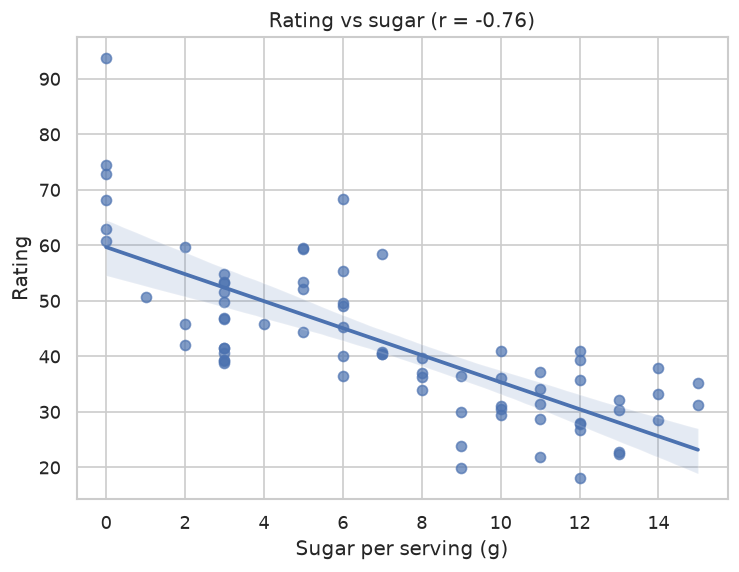
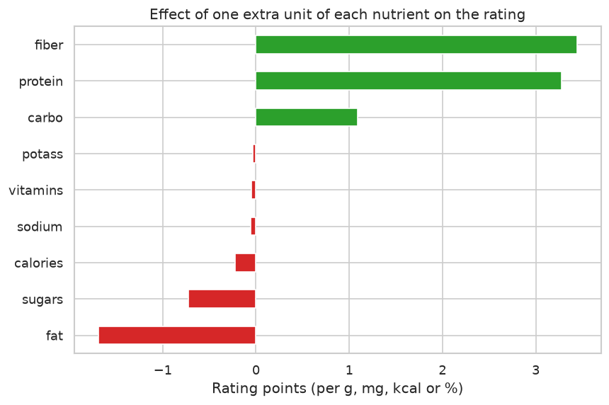

# Cereal Nutrition Analysis and Rating Prediction

Exploratory data analysis of 77 breakfast cereals and regression models (Linear, Ridge, Lasso) that predict each cereal's rating from its nutrition facts, built with pandas, seaborn and scikit-learn.

The analysis shows how much sugar popular cereals contain, which nutrients drive the rating up or down, and uncovers that the rating is not a subjective score at all: it is an exact linear formula of nine nutrition values.



## Key findings

- **Sugar is the biggest problem.** The median cereal has 7 g of sugar per serving (about 21% of its weight), and 35% of cereals have 10 g or more. Sugar has the strongest negative correlation with the rating (r = -0.76); the ten most sugary cereals are all rated below 40 out of 100.
- **The rating is a linear formula.** A linear regression on nine nutrients (calories, protein, fat, sodium, fibre, carbohydrates, sugars, potassium, vitamins) reproduces the rating with R² = 1.0. Each gram of fibre adds 3.4 points and each gram of protein 3.3, while each gram of fat costs 1.7 and each gram of sugar 0.7.
- **Model comparison.** Because the relationship is exactly linear, ordinary least squares is perfect and regularisation cannot help: Ridge (alpha = 0.05) shrinks the true coefficients and drops to R² = 0.994.

| Model                   | Test R² | Test RMSE | 5-fold CV R² |
| ----------------------- | ------- | --------- | ------------ |
| Linear Regression       | 1.0000  | 0.000     | 1.0000       |
| Ridge (L2, alpha=0.05)  | 0.9941  | 0.982     | 0.9918       |
| Lasso (L1, alpha=0.001) | 1.0000  | 0.068     | 1.0000       |



## Workflow

1. **Cleaning.** The dataset has no `NaN`s, but three cereals use `-1` as a placeholder for unknown carbohydrate, sugar or potassium values. Those rows are dropped, leaving 74 cereals.
2. **Exploration.** Distributions of every nutrient, sugar content by cereal, a correlation heatmap, and rating by shelf position, manufacturer, calories and vitamin content.
3. **Preprocessing.** Manufacturer and type are one-hot encoded and numeric features are min-max scaled inside a scikit-learn `Pipeline`, so the scaler only ever sees training data.
4. **Modelling.** Linear, Ridge and Lasso regression evaluated on a 70/30 train/test split and with 5-fold cross-validation (R², RMSE, MAE).
5. **Interpretation.** Coefficients of a linear model fitted on the raw nutrient values give the rating formula directly.

## Dataset

[80 Cereals](https://www.kaggle.com/datasets/crawford/80-cereals) from Kaggle ([`cereal.csv`](cereal.csv)): 77 cereals with 16 columns, including manufacturer, hot/cold type, per-serving nutrition facts, store shelf, serving size and a 0-100 rating.

## Run it

```bash
git clone https://github.com/salehinafnan/machine-learning-implementation.git
cd machine-learning-implementation
pip install -r requirements.txt
jupyter notebook cereal.ipynb
```

The notebook is committed with its outputs, so it can also be read directly on GitHub.

## Files

| File                                   | Description                          |
| -------------------------------------- | ------------------------------------ |
| [`cereal.ipynb`](cereal.ipynb)         | Full analysis and modelling notebook |
| [`cereal.csv`](cereal.csv)             | Dataset                              |
| [`figures/`](figures)                  | Charts exported by the notebook      |
| [`requirements.txt`](requirements.txt) | Python dependencies                  |
